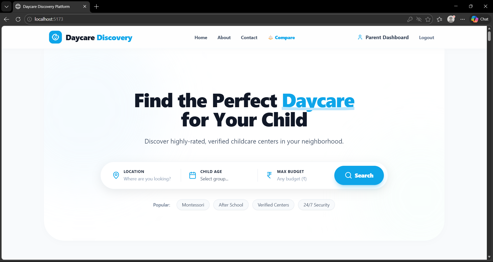
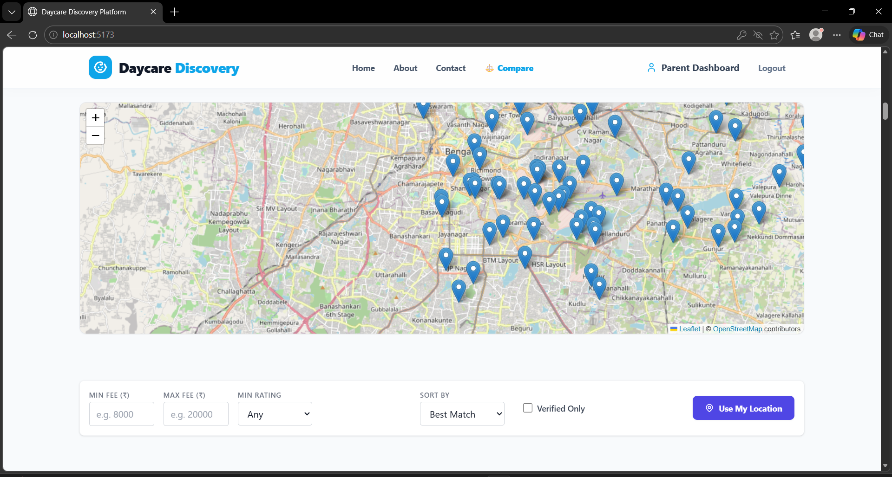
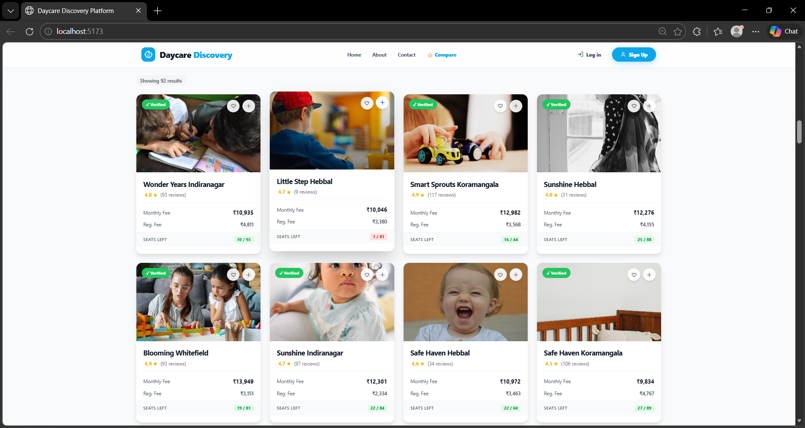

# Daycare Discovery Platform 🍼🗺️

A robust, full-stack PERN (PostgreSQL, Express, React, Node.js) web application designed to help parents manage and discover the best daycare centers. The platform features interactive maps, advanced filtering, and a custom "Best Match" sorting algorithm.

## 📸 Screenshots


<div align="center">
  
  
  <br/>
  
</div>

## ✨ Features

### Frontend (User Interface)
* **Interactive Maps:** Geospatial discovery of daycares using `react-leaflet`.
* **Responsive Design:** Fully responsive, modern UI built with `Tailwind CSS`.
* **Smooth Animations:** Page transitions and micro-interactions powered by `framer-motion`.
* **Advanced Search & Filter:** Filter by fee, ratings, and verification status in real-time.

### Backend (API & Database)
* **Secure Authentication:** User auth using `bcrypt` and `jsonwebtoken` (JWT).
* **Automated Mailing:** Email notifications integrated via `nodemailer`.
* **Custom Sorting Algorithm:** A `best_match` heuristic that balances normalized pricing and quality ratings.
* **Global Error Handling:** Catch-all mechanism for graceful database constraint violations.

## 💻 Tech Stack

**Frontend:**
* React (v18) via Vite
* Tailwind CSS & PostCSS
* React Router DOM
* React Leaflet (Mapping)
* Framer Motion (Animations)
* Axios & Lucide React

**Backend:**
* Node.js & Express.js
* PostgreSQL (`pg`)
* JWT & Bcrypt (Auth)
* Nodemailer

## 🚀 Setup & Installation

### Prerequisites
- Node.js (v14 or higher)
- PostgreSQL installed and running

### 1. Database Configuration
1. Create a PostgreSQL database (e.g., `daycare_db`).
2. Execute the schema file located in `database/schema.sql` to create the necessary tables and indexes.

### 2. Backend Setup
Navigate to the root directory (or backend folder):
```bash
# Install dependencies
npm install

# Create a .env file based on the provided template
# Add your DB and JWT credentials
touch .env

# Start the backend server (runs on http://localhost:3000 by default)
npm start
```

**Required `.env` variables for Backend:**
```env
DB_USER=your_postgres_user
DB_HOST=localhost
DB_NAME=daycare_db
DB_PASSWORD=your_postgres_password
DB_PORT=5432
PORT=3000
JWT_SECRET=your_secret_key
```

### 3. Frontend Setup
Open a new terminal and navigate to the `frontend` directory:
```bash
cd frontend

# Install dependencies
npm install

# Start the Vite development server
npm run dev
```

## 📡 API Reference

### Daycare Endpoints
* **`GET /daycares`**: Get all daycares. 
  * *Query Params:* `min_fee`, `max_fee`, `min_rating`, `is_verified`, `sort` (`lowest_fee`, `highest_rated`, `best_match`).
* **`GET /daycares/:id`**: Retrieve a single daycare.
* **`POST /daycares`**: Create a new daycare record.
* **`PUT /daycares/:id`**: Update specific fields of an existing daycare.
* **`DELETE /daycares/:id`**: Remove a daycare.

## 🧠 Algorithmic Highlights

The platform ensures optimized fetching and sorting:
* **Query Compilation:** The `GET /daycares` endpoint includes algorithmic query compilation to ensure **O(log N)** fetching utilizing PostgreSQL indexes.
* **Best Match Sorting:** The custom `best_match` sorting algorithm computes a relevance score in-memory (**O(K log K)** time complexity, where K is the number of filtered records) by balancing normalized pricing and quality ratings: `(Rating * 0.7 - Normalized Fee * 0.3)`.

## 👨‍💻 Author

**Syed Faiz Ahmed**, B.Tech Student, Presidency University 
* [GitHub Profile](https://github.com/Syed-Faiz-Ahmed) 

---
*If you like this project, please consider giving it a ⭐!*
```
